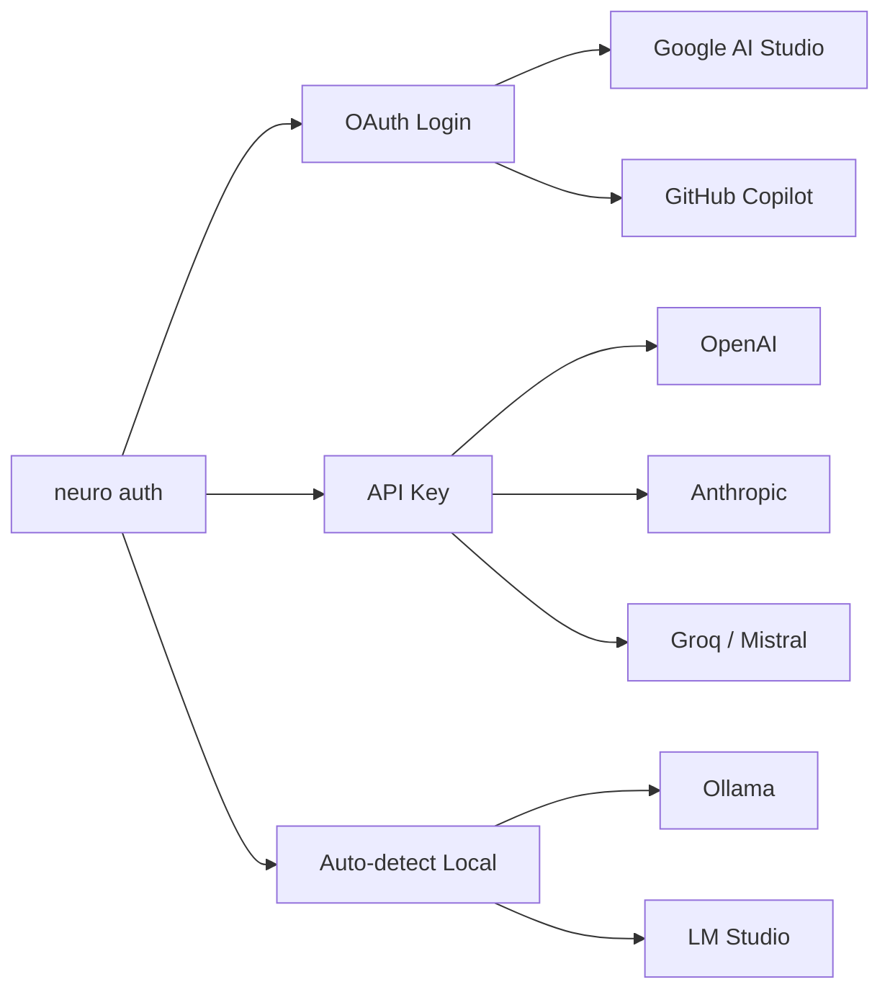

# 🧠 NeuroCLI — Phân Tích Ý Tưởng & Gợi Ý Chiến Lược

## Đánh Giá Tổng Quan

> [!TIP]
> Ý tưởng **rất mạnh** — anh đang tìm cách tạo ra **"one tool to rule them all"**: giao diện đẹp + clean như Gemini CLI, sức mạnh agentic coding sâu như Claude Code, nhưng **không bị lock vào một provider nào**.

### Điểm mạnh cốt lõi so với thị trường

| So sánh | Gemini CLI | Claude Code | **NeuroCLI (anh)** |
|---|---|---|---|
| **Model** | Chỉ Gemini | Chỉ Claude | ✅ **Mọi model** (OpenAI, Claude, Gemini, Groq, Ollama...) |
| **Auth** | Google OAuth only | Anthropic only | ✅ **Multi-auth** (OAuth + API Key + Local) |
| **UI/UX** | ⭐ Rất clean, minimalist | Functional nhưng basic | ✅ **Clean + đẹp** (lấy cảm hứng Gemini CLI) |
| **Agentic** | Tool calling + MCP | ⭐ Rất mạnh (read/edit/run) | ✅ **Deep code agent** (lấy cảm hứng Claude Code) |
| **Mở rộng** | MCP servers | Plugins | ✅ **Cả hai** |
| **Chi phí** | Free tier 60 req/min | Trả phí | ✅ **Linh hoạt** (free models + paid models) |

---

## 💡 Gợi Ý Kiến Trúc & Chiến Lược

### 1. **Model Router — Điểm USP lớn nhất**

Đây là thứ mà **không tool nào hiện tại có**. Anh nên xây một "smart router":

```
neuro --model auto "fix this bug"          → tự chọn model phù hợp
neuro --model gpt-4o "review code"         → chỉ định cụ thể
neuro --model ollama/deepseek "explain"    → dùng model local (free)
```

**Gợi ý thêm:**
- **Model aliases**: `fast` → Groq/Llama, `smart` → Claude 4 Sonnet, `cheap` → Ollama local
- **Auto-fallback**: Nếu provider A lỗi → tự chuyển sang provider B
- **Cost-aware routing**: Tự chọn model rẻ nhất cho task đơn giản, model mạnh cho task phức tạp

---

### 2. **Agent Engine — Học từ Claude Code nhưng làm tốt hơn**

Claude Code mạnh ở autonomous loop. Anh đã có prototype `src/agent/loop.ts` từ trước. Nên nâng cấp:

| Tool | Mục đích | Ưu tiên |
|---|---|---|
| `read_file` | Đọc code | ⭐ P0 |
| `edit_file` | Sửa code (search/replace) | ⭐ P0 |
| `run_command` | Chạy terminal (test, build, git) | ⭐ P0 |
| `list_dir` | Khám phá codebase | ⭐ P0 |
| `search_code` | Grep/ripgrep tìm code | P1 |
| `web_search` | Tìm docs, StackOverflow | P1 |
| `git_operations` | Commit, diff, branch | P2 |

**Điểm khác biệt nên có:**
- **Multi-model tool calling**: Mỗi provider (OpenAI, Claude, Gemini) có format tool calling khác nhau → anh cần một **adapter layer** chuẩn hóa
- **Safety boundary**: Lệnh nguy hiểm (`rm -rf`, `npm install`) cần confirm, lệnh safe (`ls`, `cat`) auto-run

---

### 3. **UI/UX — Clean như Gemini CLI**

Gemini CLI dùng **Ink (React for CLI)** — anh đã đi đúng hướng. Gợi ý chi tiết:

```
┌─────────────────────────────────────────────┐
│  🧠 NeuroCLI v1.0                          │
│  Model: claude-4-sonnet │ Tokens: 1.2k     │
│  Context: ./src (42 files)                  │
├─────────────────────────────────────────────┤
│                                             │
│  ❯ fix the authentication bug in auth.ts    │
│                                             │
│  ┌ Agent Working ──────────────────────┐    │
│  │ ℹ Reading src/auth.ts...           │    │
│  │ ℹ Found bug at line 42            │    │
│  │ ✎ Editing src/auth.ts...          │    │
│  │ ▶ Running npm test...             │    │
│  │ ✓ All tests passed                │    │
│  └─────────────────────────────────────┘    │
│                                             │
│  Done! Fixed null check in validateToken()  │
│                                             │
│  > _                                        │
└─────────────────────────────────────────────┘
```

**Nguyên tắc UI:**
- Minimalist, fast — không loading animation nặng
- Realtime streaming — text chạy mượt
- Agent actions hiển thị rõ ràng (spinner + icon)
- Markdown rendering trong terminal (code blocks, tables)

---

### 4. **Authentication — Đa dạng & Linh hoạt**



---

### 5. **Tính năng "Killer" nên có**

| Tính năng | Mô tả | Giá trị |
|---|---|---|
| **`/compare`** | So sánh output giữa 2+ models cho cùng 1 prompt | Unique, không tool nào có |
| **`/cost`** | Track chi phí realtime theo session/ngày/tháng | Developer cần biết |
| **Context files** | `NEURO.md` giống `GEMINI.md` — custom instructions per project | DX tốt |
| **MCP Support** | Kết nối external tools qua Model Context Protocol | Mở rộng mạnh |
| **Session checkpoint** | Save/resume conversation phức tạp | Workflow dài |
| **Non-interactive mode** | `neuro --yes "fix all linting errors"` chạy trong CI/CD | Automation |

---

## 🛣️ Roadmap Gợi Ý

### Phase 1 — Foundation (1-2 tuần)
- Project setup (TypeScript, ESBuild/TSX, ESLint)
- CLI framework (`commander` hoặc `yargs`)
- Multi-provider adapter (OpenAI + Anthropic + Google)
- API Key auth flow
- Basic streaming chat

### Phase 2 — Agent Engine (2-3 tuần)
- Tool registry (read_file, edit_file, run_command, list_dir)
- Agentic ReAct loop
- Tool calling adapter cho mỗi provider
- Safety confirmation layer
- TUI hiển thị agent actions

### Phase 3 — Polish & Power Features (2 tuần)
- OAuth login (Google, GitHub)
- Model aliases & smart routing
- Cost tracking
- Context management (NEURO.md, gitignore-aware)
- Session history (SQLite)

### Phase 4 — Release (1 tuần)
- NPM publish
- Documentation
- `npx neuro` one-liner install
- CI/CD non-interactive mode

---

## ⚠️ Lưu Ý Quan Trọng

> [!IMPORTANT]
> **Adapter Layer là key**: Mỗi provider (OpenAI, Anthropic, Google) có API format tool calling rất khác nhau. Anh cần đầu tư vào một `ToolCallAdapter` chuẩn hóa — đây là phần khó nhất nhưng cũng là giá trị lớn nhất.

> [!WARNING]  
> **Đừng cố làm mọi thứ cùng lúc.** Gemini CLI có team lớn, Claude Code có Anthropic đứng sau. Anh nên focus vào **1 USP duy nhất**: **multi-model + smart routing**. Làm tốt cái này trước, rồi mở rộng.

---

## Kết Luận

Ý tưởng NeuroCLI **rất khả thi và có giá trị thực**. Trên thị trường hiện tại:
- Gemini CLI = chỉ Gemini
- Claude Code = chỉ Claude  
- **NeuroCLI = TẤT CẢ models, 1 interface đẹp, agentic coding**

Đây là **gap lớn** mà chưa tool nào lấp được. Anh muốn em bắt tay vào code Phase 1 luôn không? 🚀
